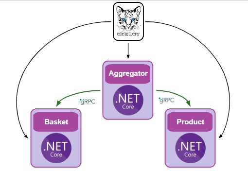
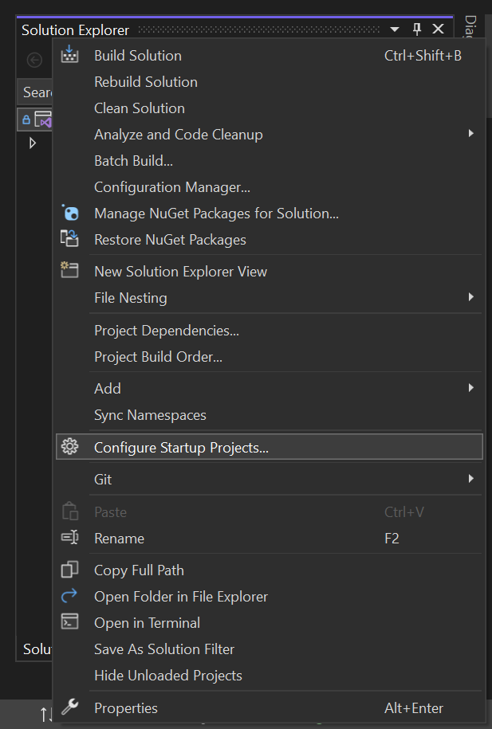
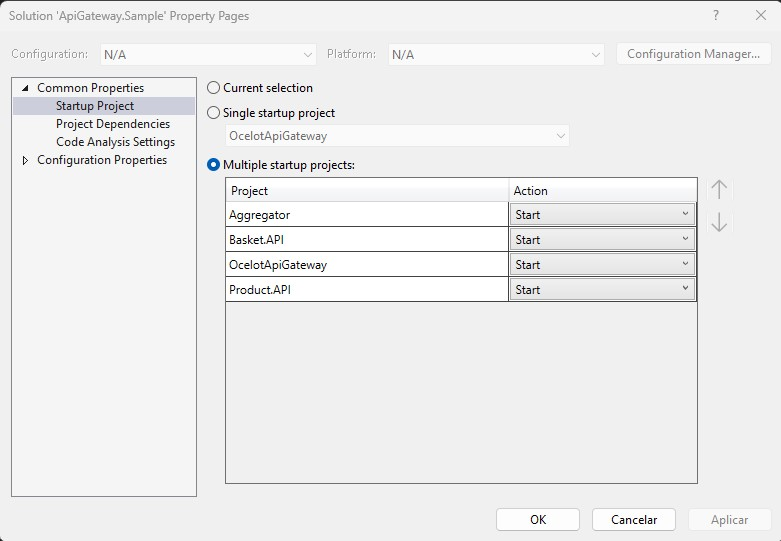
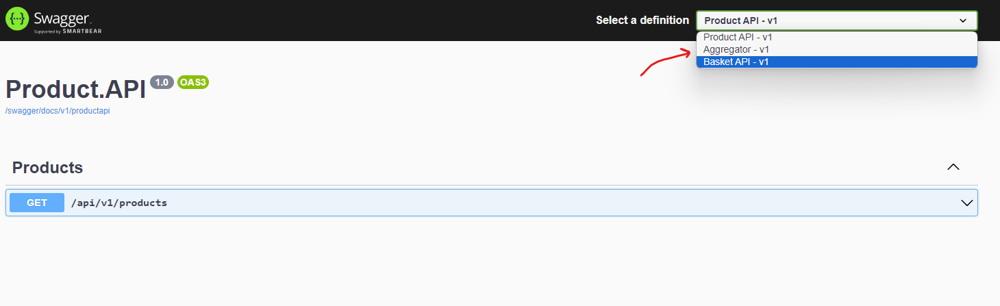

# Building an API Gateway with Ocelot + gRPC
This is a simple project that aims to show how to build an [API Gateway](https://www.nginx.com/learn/api-gateway/).

In a very simplified way, an API Gateway has two main functions:
1. Reverse proxy
2. Aggregate information from different services

To build this scenario we are using [Ocelot](https://github.com/ThreeMammals/Ocelot) which is a complete API Gateway but we will not use its aggregator function, we will have another project responsible for aggregating information from different services through [gRPC](https://grpc.io/) calls.

# Design

Basically we have 4 endpoints:
1. List all products
2. Adds a new product to a basket
3. Removes a product from a basket
4. Search all products in a basket

The API Gateway in a productive environment works as a single entry point, so all these 4 endpoints will pass through it, for each endpoint we have a rule:
1. On endpoint 1 we will forward to the Product service which will return the list of all products
2. On endpoint 2 we will forward to the aggregation service, which will make a gRPC call to the Product service to ensure that the product exists and then will make a call to the Basket service to add this product in the basket
3. On endpoint 3 we will foward to the Basket service to remove the product from a basket
4. On endpoint 4 we will forward aggregation service, which will make a gPRC call to the Basket service to get the items in that basket and then to the Product service to get information such as Name, Description and Price

# Running the project
It is necessary to start all services when running the project, for this you must:
1. Click on the solution with the right mouse button and select option `Configure Startup Projects...`

2. Select the `Multiple startup projects` and set the `Action` of the four projects to `Start`

With this configuration, when running the solution, four services will be started:
- Ocelot => https://localhost:7097/swagger
- Aggregator => https://localhost:7067/swagger
- Product API => https://localhost:7087/swagger
- Basket API => https://localhost:7298/swagger

At first, only one browser will open with Ocelot's Swagger and through it you will be able to access all the other services, but if you wanted, you can also access each of the services separately through the addresses that were listed above.

